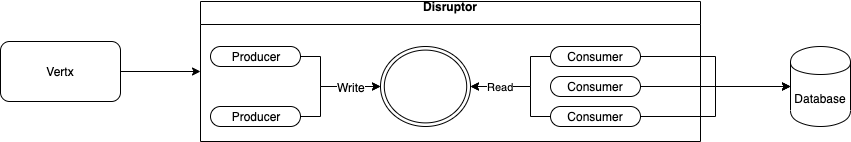

# Disruptor 


## Disruptor là gì?

[LMAX](https://www.lmax.com/) đặt mục tiêu trở thành nền tảng giao dịch nhanh nhất thế giới, vì vậy họ đã thử nghiệm để giảm latency thấp nhất. Performance testing cho thấy việc sử dụng queue để pass dữ liệu giữa các stage của hệ thống có độ trễ, vì vậy họ tập trung vào việc tối ưu hoá phần này. Và sau thời gian nghiên cứu và thử nghiệm, họ cho ra sản phẩm là `Disruptor`.

LMAX-Disruptor là một bộ thư viện giúp cho việc phát triển các ứng dụng với độ tải lớn (high-performance) cho phép xử lý đồng thời (concurrency) một số lượng rất lớn message mà không cần Lock (lock-free). Nếu bạn làm việc với Java thì thực tế đây là bộ thư viện về Concurrency tốt nhất và nhanh nhất hiện nay.

## Tại sao không phải là queue?

Việc sử dụng queue có thể sảy ra tranh chấp tại 2 điểm đầu và cuối(head, tail). Queue thường luôn gần đầy hoặc trống. Việc đó cho thấy sự khác biệt về tốc độ giữa consumer và producer. Chúng ít khi hoạt động gần như là cân bằng vềề hiệu suất.

Để tránh `write contention`, queueeue thường sử dụng locks, điều này làm giảm hiệu suất và trong ngữ cảnh kernel có thể làm mấy cache.

Nếu hai thread riêng biệt ghi vào hai giá trị khác nhau, mỗi thread có thể sẽ sẽ ảnh hưởng tới dữ liệu bên thread khác thực hiên. Đó là sự tranh chấp giữa hai thread mặc dù chúng đang ghi trên hai biến khác nhau. Điều này được gọi là `false sharing,`, bởi vì mỗi lần truy cập và để lấy head thì cũng phải lấy tail và ngược lại.

## Disruptor hoạt động như thế nào?


Ring buffer trong disruptor được filled các object trước khi thực hiện. Produces và consumers thực hiện writing hoặc reading mà không bị locking hay tranh chấp.

Trong Disruptor, tất cả event được published cho tât cả consumers(multi cast), để parallel consumption thông qua các downstream queues riêng biệt.

Producers và consumers có một bộ đếm trình tự để chỉ ra vị trí nào trong buffer mà nó hiện đang làm việc. Mỗi producer/consumer có thể viết bộ đếm trình tự riêng của mình nhưng có thể đọc bộ đếm trình tự của người khác. Producers và consumers đọc các vị trí đảm bảo vị trí mà nó muốn ghi có sẵn mà không có bất kỳ khóa nào.

## Tại sao Disruptor lại tốt?

- Disruptor không sử dụng locks và sử dụng CAS(Compare And Swap/Set). Nó hoạt động giống như optimistic lock.

- Chính nhờ sử dụng ring-buffer mà Producer có thể ghi dữ liệu trước vào vùng nhớ đệm (pre-allocate memory for events), nhờ việc đó mà giúp tránh được vấn đề về lock và contention bởi vì ở cấp độ hard-ware thì entries có thể được nạp trước (pre-load) và ring buffer, nhờ thế CPU process không cần phải quay lại main memory (L3 hoặc Ram) để lấy tiếp các item trong ring buffer. Và các event có thể được sử dụng lại (object reuse) trong suốt thời gian Disruptor đang được hoạt động và tránh các rắc rối với garbage collector.

## Ring size = 2^n?

Nếu size của ring là 2^n, ring buffer sẽ sử dụngdụng masking thay vì toán tử modulo để tìm vị trị trong ring.

Ví dụ:
```log
size = 32
bin(size) => '00100000'

mask = size - 1;
bin(mask) => '00011111'

sequence = 4
bin(4 & mask) => '00000100' (4)

sequence = 32
bin(sequence & mask) => '00000000' (0)

sequence = 33
bin(sequence & mask) => '00000001' (1)
```

Như ví dụ trên, nếu sequence=33, thì vì muốn tìm index trong ring ta sẽ dùng `index=33%32=1`. Thay vào đó ta chỉ cần `bin(33 & mask) => 00000001 ~ 1`. Kết quả tìm kiếm sẽ nhanh hơn nhiều so với toán tử modulo.


## Apply với vertx

Mô hình apply disruptor với vertx



Hệ thống sẽ dùng disruptor trong việc thao tác với cơ sở dữ liệu, thay thế cho worker pool trong vertx-jdbc

## Benchmark

### Setup

Môi trường:
- Server: 10.50.1.22
- Client: 10.50.1.23
- Prometheus: 10.50.1.22
- Tidb server: 10.30.17.173

Kịch bản: Dùng `ghz` để bắn request trong vòng 10 phút và đo kết quả `latency(p99)`, `throughput` cho đến khi kết quả đạt mức ổn định.

### Cấu hình tham số của server

|Worker pool size vertx|Number instant grpc vertx|Connection pool|
|--|--|--|
|64|32|64|

### Kết quả:

- Sử dụng JDBC-vertx

||Throughput|Latency(p99)|
|--|--|--|
|JDBC-Vertx|11392|0.020431|

- Sử dingj Disruptor
  
|Number Worker in disruptor|Buffer ring size|WaitStrategy|Throughput|Latency(p99)|
|--|--|--|--|--|--|
|256|65536|BusySpinWaitStrategy|12421|0.020187|
|128|65536|BusySpinWaitStrategy|16055|0.018122|
|64|65536|BusySpinWaitStrategy|32637|0.007099|
|64|1024|BusySpinWaitStrategy|320001|0.007123|
|32|65536|BusySpinWaitStrategy|25236|0.0090031|
|64|65536|BlockingWaitStrategy |33355|0.006878|

<b>Kết quả cho thấy khi số worker trong disruptor bằng số connection pool thì kết quả đạt ngưỡng cao nhất.<b>


